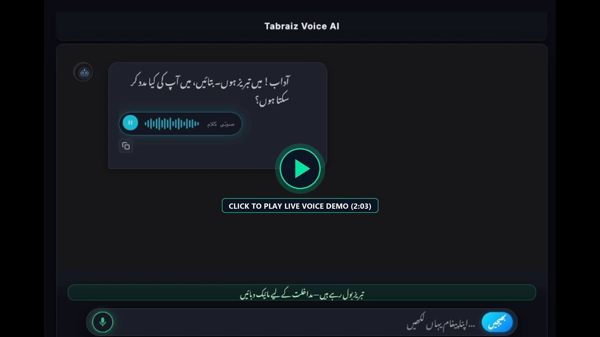
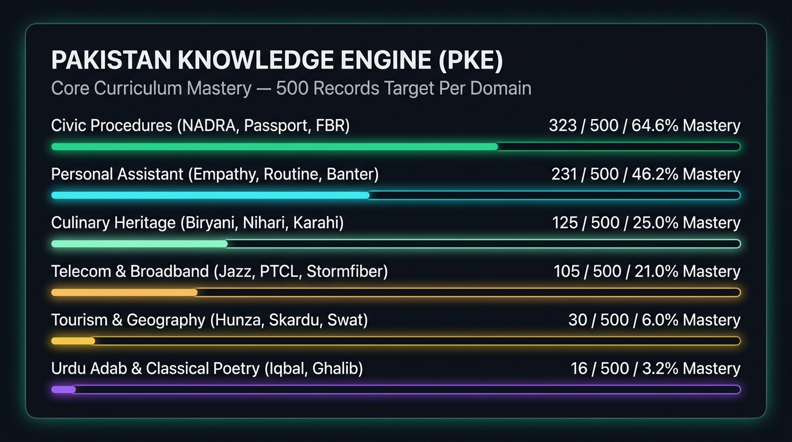

# Tabraiz A.I — Sovereign Conversational Voice AI Agent

> **Pakistan's First Sovereign Voice AI Agent** — Powered by **Qwen 2.5 7B Instruct** with deep domain adaptation via the **Pakistan Knowledge Engine (PKE)**. Deployed serverlessly on **Modal.com** (NVIDIA A100 for heavy training, NVIDIA L4 for low-latency serving) with an intelligent Multi-Oracle Cognitive Orchestrator.
> 
> *0% Local GPU Load • 0% Persistent GCS Cost • 100% Culturally Sovereign*

---

## 🎬 Live Voice Demo & Conversational Interaction

Experience Tabraiz A.I in action — real-time bilingual voice interaction, low-latency conversational speech synthesis, and fluid code-switching on mobile Safari:

[](https://drive.google.com/file/d/1nsiN9LjdhBBjIunDu1Np1AJuUm99p4mk/view?usp=sharing)

> 📺 **[▶ Click Here to Watch the Live Mobile Voice Demo (Google Drive HD Stream)](https://drive.google.com/file/d/1nsiN9LjdhBBjIunDu1Np1AJuUm99p4mk/view?usp=sharing)**  
> *(Demonstrates hands-free Urdu/English voice interaction, dynamic dual-probe ASR, and sub-second voice onset on iOS).*

---

## 📖 Introduction: What is Tabraiz A.I?

**Tabraiz A.I** is an autonomous, bilingual conversational voice agent engineered specifically for Pakistan. 

Unlike conventional chatbots that simply wrap US-based API endpoints and translate English phrases literally into disjointed Urdu, Tabraiz A.I is built from the ground up to address the unique linguistic and institutional realities of Pakistan:

* **Authentic Cultural Tone:** Speaks with natural, respectful Pakistani conversational warmth (consistently addressing citizens with **'آپ'** and eliminating cold, robotic or informal language).
* **Code-Switching Fluency:** Seamlessly navigates conversations that blend Urdu, Roman Urdu, and English, understanding everyday Pakistani street vernacular and technical terminology simultaneously.
* **Autonomous Agentic Capabilities:** Tabraiz is an **active voice agent** rather than a passive text box. It listens via real-time Web Audio, orchestrates multi-tier knowledge retrieval (RAG), silently persists episodic memories to a local database, queries live web search for 2026 facts, and synthesizes on-demand diffusion artwork without blocking voice playback.

---

## 📊 Core Curriculum Mastery (Pakistan Knowledge Engine)



### **What is the Pakistan Knowledge Engine (PKE)?**
The **Pakistan Knowledge Engine (PKE)** is the specialized domain-intelligence layer that powers Tabraiz A.I. 

Generic frontier LLMs (ChatGPT, Gemini) are predominantly trained on Western internet dumps where Pakistani public services and cultural context are virtually nonexistent or outdated. PKE bridges this gap by grounding the model directly in:
1. **Civic Procedures:** Official requirements, fee structures, and step-by-step guidance for NADRA Smart Cards, Child Registration (B-Form), Family Registration Certificates (FRC), Passports, FBR Tax Returns, and DLIMS driver's licenses.
2. **Telecom & Broadband:** Real-time packages, balance inquiries, SIM activations, and USSD activation codes (`*777#`) for Jazz, Zong, Telenor, Ufone, PTCL Flash Fiber, and Stormfiber.
3. **Everyday Life & Empathy:** Polite personal assistant workflows, scheduling reminders, advice, and supportive conversation.
4. **Culinary Heritage:** Traditional Pakistani gastronomy, authentic regional recipes (Biryani, Nihari, Karahi, Sajji), and culinary history.
5. **Geography & Northern Tourism:** Guidance across Hunza, Skardu, Swat, Naran, Gwadar, and historical monuments.
6. **Urdu Adab & Classical Literature:** Ghazals, verses, and philosophical context from Allama Iqbal, Mirza Ghalib, and Faiz Ahmed Faiz.

### **How PKE Works Under the Hood:**
* **Curated ChatML Alignment:** Over 1,125+ vetted conversational dialogue turns mapped against a standard target of **500 records per domain**.
* **Heavy QLoRA Cloud Adaptation:** Fine-tuned on high-throughput **NVIDIA A100 Tensor Core GPUs on Modal.com ($2.79/hr)** across all 7 linear projection matrices (`q_proj`, `k_proj`, `v_proj`, `o_proj`, `gate_proj`, `up_proj`, `down_proj`).
* **Anti-Degeneration Decoding:** Solves the Urdu token fragmentation crisis (Arabic script consuming 2–4 tokens per character) through tuned repetition penalties (`1.25`), `no_repeat_ngram_size=4`, and real-time loop-pruning filters that eliminate repetitive loops.
* **Phonetic Normalization:** Converts technical acronyms (`CEO`, `NADRA`, `FBR`, `PTCL`, `Wi-Fi`) and English numerals into fluid spoken Urdu phonetics.

---

## 🗺️ Official Engineering Roadmap & Technical Whitepaper

For in-depth architectural blueprints, financial cost modeling for 1,000 users consuming 1 Billion tokens/month, telecom migration studies, and citizen PII protection:

* 📄 **[Adaab Engineering Roadmap (Print-Ready PDF)](Adaab_Engineering_Roadmap.pdf)**
* 🌐 **[Adaab Engineering Roadmap (Interactive HTML Blueprint)](adaab_engineering_roadmap.html)**

---

## 🌟 Key Architecture & Capabilities

1. **Dual-Persona System:** Male Tabraiz (`ur-PK-AsadNeural`) for deep cultural guidance and female Tehzeeb (`ur-PK-UzmaNeural`) for refined elegance.
2. **Dynamic Dual-Probe ASR:** Real-time acoustic detection in `voice_listener.py` overcoming code-switching transliteration traps between English and Arabic script.
3. **Cognitive Orchestrator:** Resolves compound voice queries (e.g. *"Can you switch to English and tell me how to renew my CNIC?"*) in a single seamless turn.
4. **Silent Relational Memory:** Persistent user profiles and conversation history running asynchronously in SQLite with zero voice latency penalty.
5. **Zero-Cost Sovereign Cloud Stack:** Serverless compute on Modal.com with automatic scale-to-zero + free 5TB weight backups via Google Drive v3 API.
6. **Mobile Audio Hardening:** Optimized for iOS Safari and compact screens (iPhone SE 2020), utilizing `RemoteIO` to support simultaneous iOS screen recording without muting the mic.

---

## 🛠️ Step-by-Step Setup Guide

Follow this guide to get Tabraiz A.I running on your local machine and connected to cloud GPU inference.

### **Prerequisites & Account Setup**

Before running the application, set up the following free/developer accounts:

#### 1. Hugging Face Account
* Sign up at [huggingface.co](https://huggingface.co).
* Navigate to **Settings &rarr; Access Tokens**.
* Create a **Read** token (or **Write** token if pushing custom models).
* You will use this token (`HF_TOKEN`) to download base models such as `Qwen/Qwen2.5-7B-Instruct`.

#### 2. Modal.com Account (Serverless Cloud GPU)
* Sign up at [modal.com](https://modal.com) using your GitHub account (Modal provides a **\$30/month free recurring credit**, sufficient for development and testing).
* Install the Modal client locally:
  ```bash
  pip install modal
  ```
* Authenticate your machine with Modal:
  ```bash
  modal setup
  ```
* This connects your local environment directly to Modal’s cloud cluster for running NVIDIA A100 training and NVIDIA L4 serving.

#### 3. Google Gemini API Key (Optional Knowledge Oracle)
* Get a free API key at [Google AI Studio](https://aistudio.google.com).
* Tabraiz uses Gemini 2.5 Flash as an auxiliary search and general reasoning oracle with circuit-breaker protection.

#### 4. Ollama Cloud API Key (Optional Code & Reasoning Oracle)
* Get an API key from [Ollama Cloud](https://ollama.com) to enable `gemma4:31b` deep logic fallback.

---

### **Installation & Local Setup**

#### Step 1: Clone the Repository
```bash
git clone https://github.com/your-username/Adaab.git
cd Adaab
```

#### Step 2: Create a Virtual Environment
```bash
# Windows
python -m venv .venv
.venv\Scripts\activate

# macOS / Linux
python3 -m venv .venv
source .venv/bin/activate
```

#### Step 3: Install Dependencies
```bash
pip install -r requirements.txt
```

#### Step 4: Configure Credentials
Copy the safe template file to `credentials.txt`:
```bash
cp credentials.template.txt credentials.txt
```
Open `credentials.txt` in your text editor and add your tokens:
```ini
HF_TOKEN=hf_your_huggingface_token_here
GEMINI_API_KEY=AIzaSy_your_gemini_key_here
OLLAMA_API_KEY=your_ollama_key_here
```
> 🔒 **Security Notice:** `credentials.txt` is strictly git-ignored and will never be committed to your repository.

---

## 🚀 Running Tabraiz A.I

### Option A: The Master Interactive CLI (Recommended)
Launch the comprehensive English management terminal:
```bash
python start.py
```
From this controller, you can:
* **Option 1:** Launch Web UI locally (`http://localhost:7860`).
* **Option 2:** Launch Web UI with Cloudflare Tunnel (provides a public HTTPS link for your smartphone).
* **Option 3:** Deploy / Re-deploy the vLLM engine to Modal NVIDIA L4 GPU.
* **Option 4:** Launch heavy QLoRA fine-tuning on Modal NVIDIA A100 GPU.
* **Option 6:** View the live Curriculum Mastery Ledger (`training_tracker.py`).
* **Option 10:** Run automated test suites.

### Option B: Launch Web Interface Directly
```bash
# Local access only
python app.py

# Public mobile access via Cloudflare Quick Tunnel (Ideal for iPhone/Android testing)
python app.py --tunnel
```

---

## 🧪 Verification & Automated Testing

Run the full 12-point automated test suite to verify your environment, audio codecs, and cloud connections:
```bash
python test_suite.py
```

**Test Coverage Verified:**
* `TEST-01`: SQLite relational memory persistence
* `TEST-02`: Urdu font system (`tahoma.ttf` / `segoeui.ttf`)
* `TEST-03`: GPU telemetry & crash tracker
* `TEST-04`: Neural TTS voice generation (`ur-PK-AsadNeural`)
* `TEST-05`: Text cleaning & artifact purging
* `TEST-06`: Local Pakistani date and time context engine
* `TEST-07`: Tabraiz identity recognition
* `TEST-08`: Modal serverless backend health check
* `TEST-09`: Strict Urdu-first linguistic etiquette
* `TEST-10`: Microphone ASR pipeline readiness
* `TEST-11`: Dual persona & female voice synthesis (`ur-PK-UzmaNeural`)
* `TEST-12`: Anti-looping decoding & 5-gram loop pruning filter

---

## 📁 Repository Directory Structure

```
├── app.py                     # Responsive conversational web UI (Gradio 6)
├── agent.py                   # Conversational agent & system prompts
├── orchestrator.py            # Cognitive intent routing & compound query extraction
├── backend.py                 # Modal serverless client & GPU keep-alive heartbeat
├── deploy_adaab.py            # Modal vLLM deployment (NVIDIA L4, Volume cache)
├── training_tracker.py        # Pakistan Knowledge Engine (PKE) curriculum ledger
├── train_qwen_pakistan_lora.py# Modal A100 heavy QLoRA fine-tuning script
├── gemini_oracle.py           # Multi-tier knowledge oracle & circuit breaker
├── voice_listener.py          # Audio transcription & dual-probe ASR pipeline
├── voice_reader.py            # Neural TTS synthesis & phonetic pronunciation engine
├── memory_engine.py           # SQLite episodic memory & user profile tracker
├── image_gen.py               # Cloud diffusion visual artwork generation
├── time_context.py            # Real-time Pakistani date and time provider
├── network_helper.py          # Cloudflare tunnel & local SSL management
├── crash_tracker.py           # GPU telemetry & error tracking
├── start.py                   # Master CLI controller
├── test_suite.py              # Automated 12-point unit test suite
├── credentials.template.txt   # Safe template for API keys (no secrets tracked)
├── Adaab_Engineering_Roadmap.pdf   # Print-ready engineering whitepaper
├── adaab_engineering_roadmap.html  # Interactive HTML architecture roadmap
├── curriculum_mastery_500.jpg      # Curriculum mastery visual breakdown
├── data/
│   ├── master_training_dataset.jsonl    # Master compiled ChatML LoRA dataset
│   └── pakistan_knowledge_dataset.jsonl # Pakistan cultural knowledge pairs
└── assets/
    └── icons/                 # UI assets and iconography
```

---

## 📄 License & Attribution

Architected and developed by **Ammad Raza**.  
Built for sovereign conversational AI in Pakistan with zero vendor lock-in and zero mandatory recurring GPU expenses.
